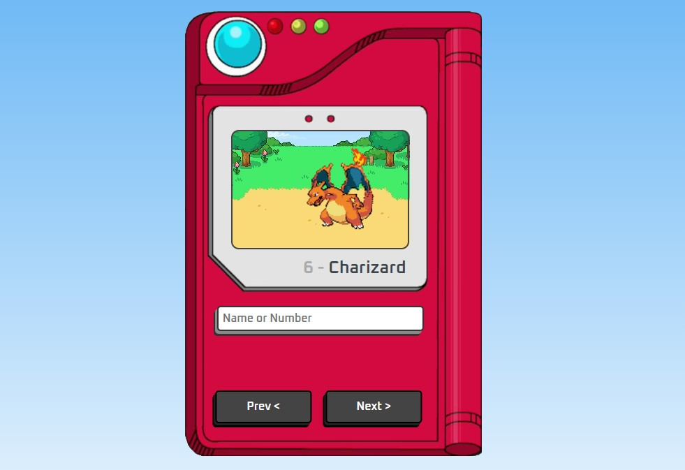

<h1 align="center">Pokédex - Manual do Dev</h1>

Este código foi feito de maneira educacional e passado através do canal <a href="https://www.youtube.com/@ManualdoDev">Manual do Dev</a>. 

  <a href="#-tecnologias">Tecnologias</a>&nbsp;&nbsp;&nbsp;|&nbsp;&nbsp;&nbsp;
  <a href="#-projeto">Projeto</a>&nbsp;&nbsp;&nbsp;|&nbsp;&nbsp;&nbsp;
  <a href="#-layout">Layout</a>&nbsp;&nbsp;&nbsp;|&nbsp;&nbsp;&nbsp;
  <a href="#memo-licença">Licença</a>

  

## 🚀 Tecnologias

Esse projeto foi desenvolvido com as seguintes tecnologias:

- HTML e CSS
- JavaScript
- Git e Github
- API

## 💻 Projeto

O objetivo do projeto foi montar uma pokédex funcional onde é possível pesquisar pelo Pokémon através do número da pokédex ou pelo nome.
- [Acesse o projeto finalizado online](https://luizrantunes.github.io/learning-programming/pokedex-challenge)

## 🔖 Layout

O Layout e outras imagens podem ser acessados na pasta image do projeto.

## :memo: Licença

Esse projeto de aprendizado foi feito graças ao canal <a href="https://www.youtube.com/@ManualdoDev">Manual do Dev</a>.

---

Feito com ♥ by Luiz Antunes :thumbsup: